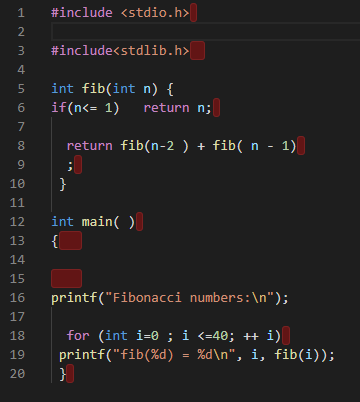

# Tutorium 2020-03-30

## Code formatting

When looking at the submitted solutions I noticed that proper formatting was done by pretty much no one. I looked through about 50 submissions and of those, I would say about 3 were formatted consistently, either by hand, or using clang-format.

Here's what badly formatted code looks like in my Visual Studio Code:

I am not saying the submissions were as bad as this, but some got pretty close. This is unreadable and completely unacceptable. And it is so easy to do this right, there are tools that automatically format your code to be readable. Here's the most common one: [clang-format](clang-format/README.md)

If you are wondering about the parts marked in red, that's done by the [Trailing Spaces](https://marketplace.visualstudio.com/items?itemName=shardulm94.trailing-spaces) extension.

## Fork

## Sigaction
