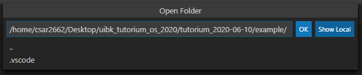
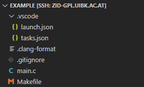
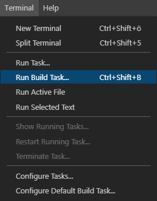
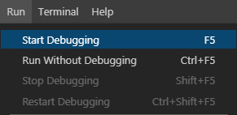
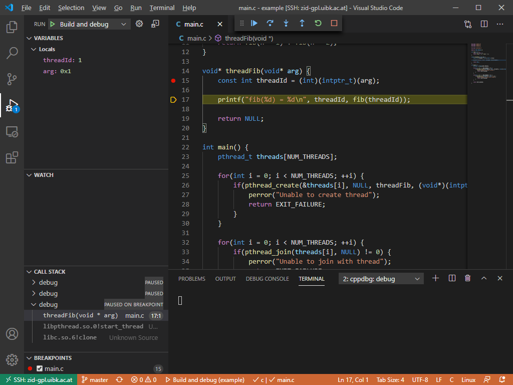
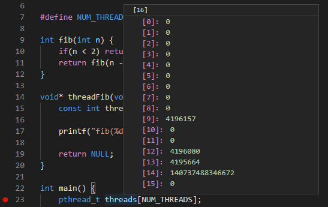
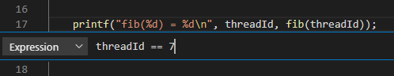

# Tutorium 2020-06-10 (draft)

In light of the upcoming exam, I thought I'd give you some tooling to help streamline your development and especially debug cycle on the zid-gpl server.

I assume that a large number of you uses Visual Studio Code as your text editor, so I'll only cover that. If you're using different tools you're gonna have to figure out what works best for you and your tools.

The amount of time you have available for the exam is somewhat limited and you **will** run out of time if you need to set up your build environment first.
So make sure you have your tooling in-order before the exam starts.

## Visual Studio Code Remote - SSH

Through the use of the [Remote - SSH](https://marketplace.visualstudio.com/items?itemName=ms-vscode-remote.remote-ssh) extension, Visual Studio Code allows you to connect to a remote system using SSH and build/debug/run your software there, all while using your local Visual Studio Code instance, running on whatever OS you're using.

This is very useful in general, but should be especially useful for the exam, since it is a hard requirement that your program compiles and runs on zid-gpl.

### Setting up Remote - SSH

After installing the extension you can start a SSH session by clicking  in the bottom left.

You can then connect to a host.

This will run you through the necessary steps of adding a new host and allow you to connect to it. The process should be very straight forward, but if you're having trouble look at the [Getting started](https://marketplace.visualstudio.com/items?itemName=ms-vscode-remote.remote-ssh) section of the extension or follow the [step-by-step tutorial](https://aka.ms/vscode-remote/ssh/tutorial) linked there.

### Remote Extensions

If you connect to some remote system using this extension you will not have any extensions installed in your remote session. So you'll have to reinstall all extensions that you'll want to use and they will be installed into your home directory on the remote system.

You'll probably want at least the [C/C++](https://marketplace.visualstudio.com/items?itemName=ms-vscode.cpptools) extension and maybe [Trailing Spaces](https://marketplace.visualstudio.com/items?itemName=shardulm94.trailing-spaces).

#### Clang-format

Sadly the zid-gpl system does not have `clang-format`, not even as a module. But there is a pre-built static binary on [github](https://github.com/muttleyxd/clang-format-static-binaries/releases), which you can use. For general clang-format integration see my [previous writeup](../tutorium_2020-03-30/clang-format/README.md).  
To get `clang-format` working through a remote connection you'll have to download the binary from github (or use the one in this [repo](clang-format-10_linux-amd64)) and put it somewhere in your home directory on zid-gpl. Then you'll need to set the absolute path to this executable in the settings of the clang-format extension (File -> Preferences -> Settings -> Extensions -> Clang-Format Configuration -> Executable).

## Example project

I've set up a small example project with a basic makefile. I've also pre-configured vscode build tasks that invoke `make` and a debug config to get gdb integration into the vscode debugger UI. You can use this to build and debug your program through Visual Studio Code on zid-gpl.

### Opening the project

In order for the integration to work you have to open the [example folder](./example/) with vscode in a remote session.

This will allow vscode to find the `launch.json` and `tasks.json` files and integrate building and debugging.

### Building the project

You can build your project by running the build task, for easy of use use the corresponding shortcut.

Since there are multiple build tasks vscode will ask you which one you want. It will remember your last choice and allow you to just hit `Enter` to use the same choice again. So build just becomes `Ctrl+Shift+B` `Enter`.

I've configured the build tasks in a way that they only open the output window if there was an error. You should regularly build your program during development to catch mistakes early, so having the build output only show up on errors is very handy for that.

### Debugging the project

To start debugging select _Start Debugging_ and vscode will automatically invoke `make debug` to create a debug build and launch `gdb` with the binary and integrate everything into the debug GUI.

If you don't have any breakpoint set this will just simply build and run your program and show you the output.

But if you set a breakpoint (left-click on the left side of the line number) and hit `F5` your program will break at the breakpoint.

In this view you can see the values of local variables, add custom watch expressions, and see the call stack, which shows you how you got to this point.

#### Hover

Another very useful feature is that you can hover over variable names to see their values.

_Notice: You can clearly see that there is some garbage in the `threads` array, because this is before it is properly initialized._

#### Conditional breakpoints

If you're trying to debug some behavior that only happens sometimes, you can use conditional breakpoints for this.

Simply right-click instead of left-click and select `Add Conditional Breakpoint...` and type in the expression that must be true in order for this breakpoint to trigger. In this case the breakpoint only triggers for thread 7, which might be very useful to track down bugs that only happen in a specific thread.

#### Debug controls

Familiarize yourself with the debug controls (hover over them to see what they do and their shortcut).

With the proper shortcuts you can very easily navigate (step-over, step-into) your program and can keep an eye on your variables to see their values and how they change. Use this to step through your code and observe its behavior.

